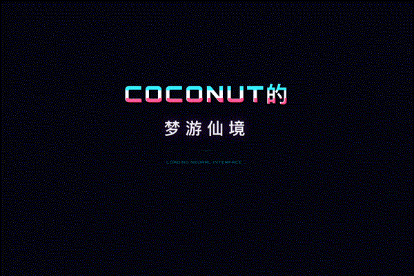
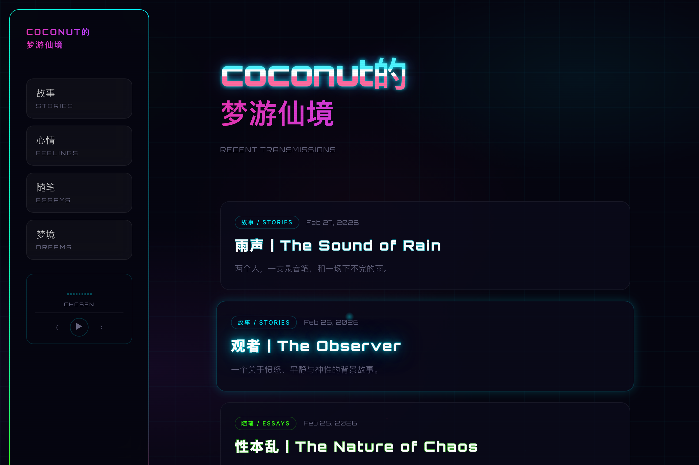

<p align="center">
  
</p>

<h1 align="center">
  <code>nocturne</code>
</h1>

<p align="center">
  stories / dreams / essays — bilingual
</p>

<p align="center">
  <a href="https://y0-x-0y.github.io/nocturne">
    
  </a>
</p>

---

<p align="center">
  
</p>

A cyberpunk-themed writing space. Neon glows, animated grids, glitch text, scanlines, floating particles. Every piece written in Chinese and English, switchable mid-read.

Boot-sequence splash on first visit. SPA navigation with cyberpunk loading transitions. Built-in music player that persists across pages.

---

<h3 align="center">Reading</h3>

<p align="center">
  
</p>

Each post has a bilingual title and a language toggle. Switch between Chinese and English without page reload.

---

### Categories

```
STORIES    fiction and narrative
FEELINGS   personal reflections
ESSAYS     philosophy and debate
DREAMS     dream journals
```

---

### Stack

Astro + Tailwind CSS + GitHub Pages

```bash
npm install && npm run dev
```
